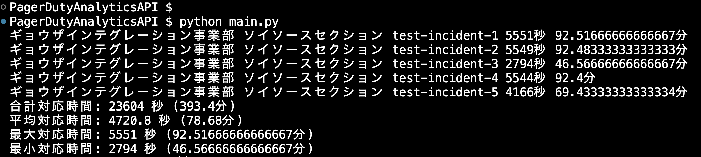

# PagerDuty Fun Book用のリポジトリです

## このリポジトリについて

このリポジトリは、PagerDutyファンブックに付属するサンプルコードや資料を提供するためのリポジトリです。

## ファイル構成

- `README.md`: このファイルです
- img: 画像ファイルを格納するディレクトリです
- json: JSONファイルを格納するディレクトリです。今回はサンプルデータを格納しています
- main.py: サンプルコードを格納しています。Pythonで書かれています

## サンプルコードの実行方法

1. このリポジトリをクローンします
2. クローンしたリポジトリに移動します
3. `main.py`を実行します

```bash
python main.py
```

## 実行結果

以下のような結果が表示されます

